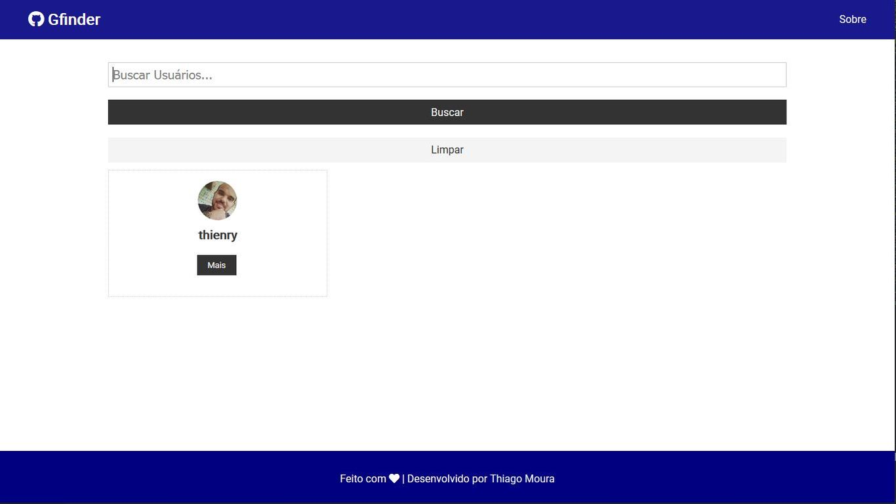

# Gfinder

It is an Application that allows its users to search users and their respective Github repositories.



## Instalação

OS X & Linux & Windows:

Instale as dependências

```bash
npm install
```

## Meta

Thiago Moura – [Thiagotec.com](https://thiagotec.com) – thmoura14@gmail.com

Distribuído sob a licença MIT. 

<!-- Markdown link & img dfn's -->
[npm-image]: https://img.shields.io/npm/v/datadog-metrics.svg?style=flat-square
[npm-url]: https://npmjs.org/package/datadog-metrics
[npm-downloads]: https://img.shields.io/npm/dm/datadog-metrics.svg?style=flat-square
[travis-image]: https://img.shields.io/travis/dbader/node-datadog-metrics/master.svg?style=flat-square
[build-development]: https://img.shields.io/badge/Build-development-yellow
[wiki]: https://github.com/yourname/yourproject/wiki
